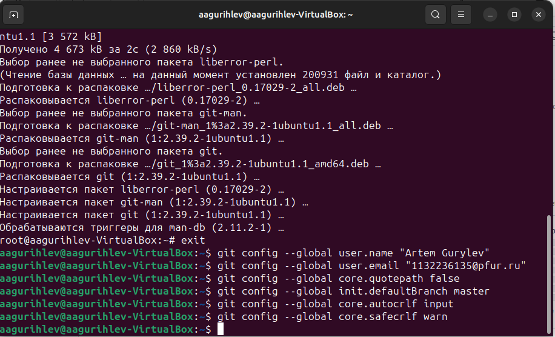
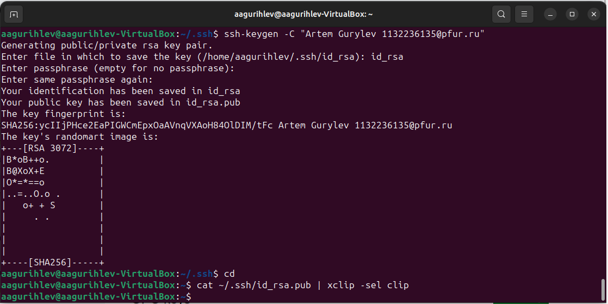
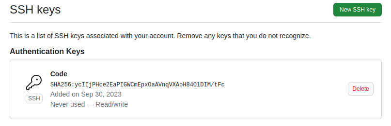
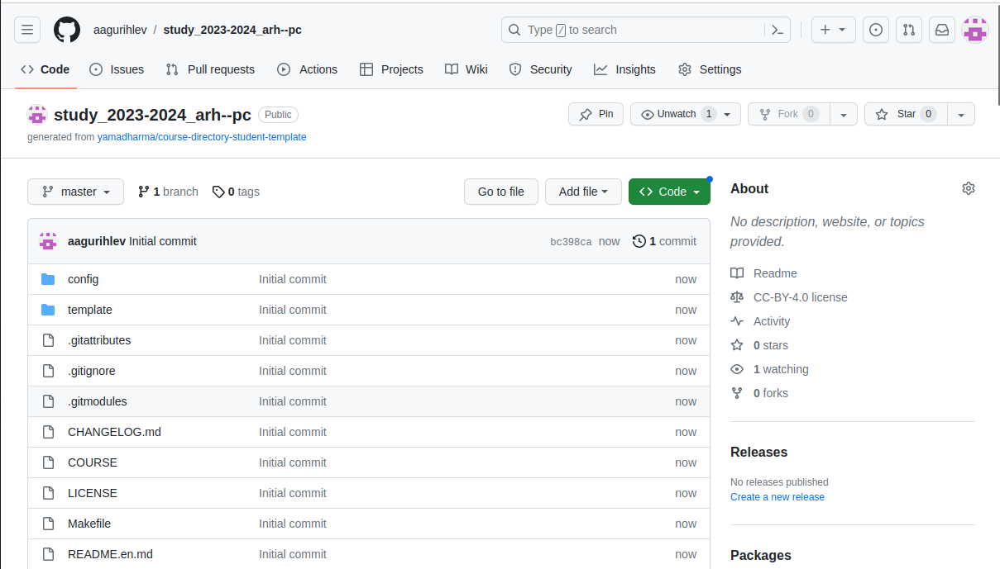
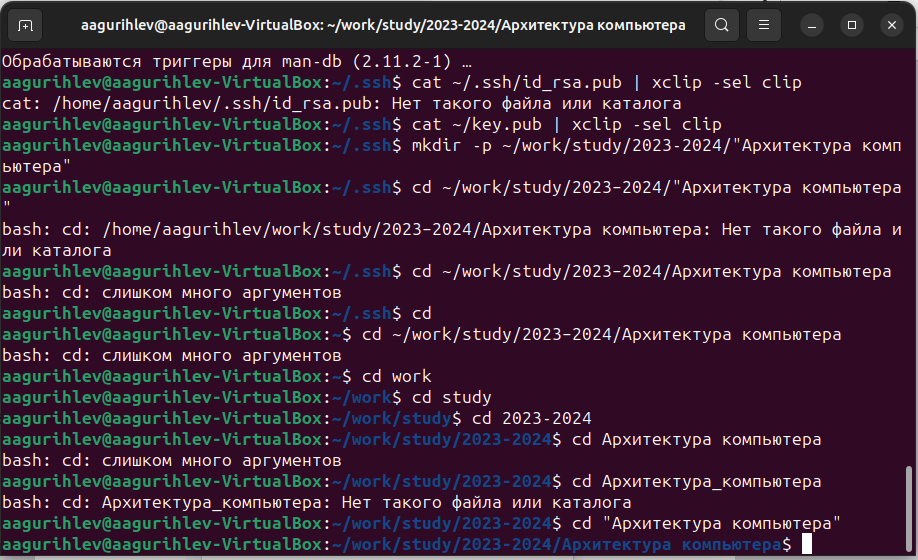
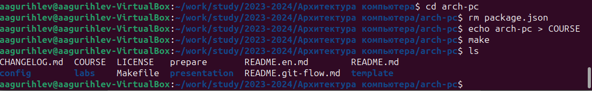
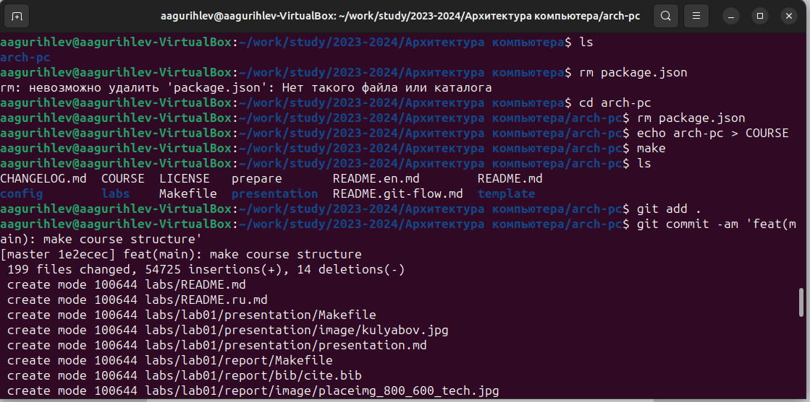
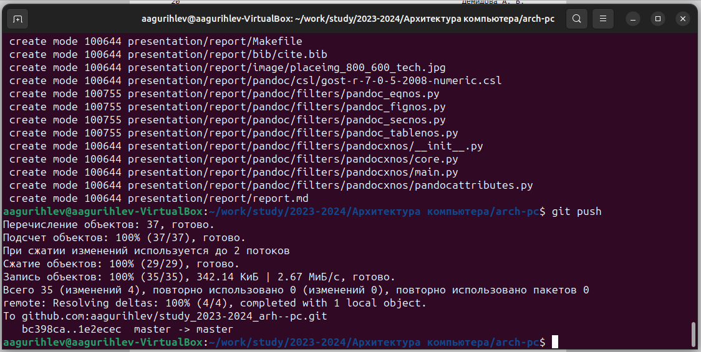
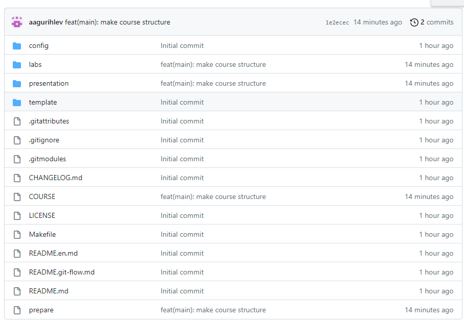

---
## Front matter
title: "Лабораторная работа №2"
subtitle: "Система контроля версий Git"
author: "Гурылев Артем Андреевич"

## Generic otions
lang: ru-RU
toc-title: "Содержание"

## Bibliography
bibliography: bib/cite.bib
csl: pandoc/csl/gost-r-7-0-5-2008-numeric.csl

## Pdf output format
toc: true # Table of contents
toc-depth: 2
lof: true # List of figures
lot: true # List of tables
fontsize: 12pt
linestretch: 1.5
papersize: a4
documentclass: scrreprt
## I18n polyglossia
polyglossia-lang:
  name: russian
  options:
	- spelling=modern
	- babelshorthands=true
polyglossia-otherlangs:
  name: english
## I18n babel
babel-lang: russian
babel-otherlangs: english
## Fonts
mainfont: PT Serif
romanfont: PT Serif
sansfont: PT Sans
monofont: PT Mono
mainfontoptions: Ligatures=TeX
romanfontoptions: Ligatures=TeX
sansfontoptions: Ligatures=TeX,Scale=MatchLowercase
monofontoptions: Scale=MatchLowercase,Scale=0.9
## Biblatex
biblatex: true
biblio-style: "gost-numeric"
biblatexoptions:
  - parentracker=true
  - backend=biber
  - hyperref=auto
  - language=auto
  - autolang=other*
  - citestyle=gost-numeric
## Pandoc-crossref LaTeX customization
figureTitle: "Рис."
tableTitle: "Таблица"
listingTitle: "Листинг"
lofTitle: "Список иллюстраций"
lotTitle: "Список таблиц"
lolTitle: "Листинги"
## Misc options
indent: true
header-includes:
  - \usepackage{indentfirst}
  - \usepackage{float} # keep figures where there are in the text
  - \floatplacement{figure}{H} # keep figures where there are in the text
---

# Цель работы

Целью работы является изучить идеологию и применение средств контроля версий и приобрести практические навыки по работе с системой git.

# Выполнение лабораторной работы

Настроим git для первоначальной работы(рис. @1):

{#fig:1}

Используем команду ssh-keygen, чтобы сгененерировать публичный и приватный ssh-ключи, которые понадобятся для аутентификации(рис. @2):

{#fig:2}

Скопировав содержимое файла с ключем, добавим его на Github(рис. @3):

{#fig:3}

Используем указанный репозиторий в качестве шаблона и убедимся, что клонирование прошло успешно(рис. @4):

{#fig:4}

Создадим рабочий каталог и подкаталоги в домашнем каталоге, в которые мы впоследствии будем клонировать наш репозиторий, и перейдём в него(рис. @5):

{#fig:5}

Убедимся, что клонирование репозитория прошло успешно(рис. @6):

{#fig:6}

Введём последовательность команд для создания правильной файловой структуры, и убедимся в её наличии(рис. @7):

{#fig:7}

Добавим изменения в репозиторий командами git, после чего отправим репозиторий на Github(рис. @8, @9):

{#fig:8}

{#fig:9}

Убедимся, что изменения кода прошли на Github(рис. @10):

{#fig:10}

# Выполнение самостоятельной работы

Создадим отчет для второй лабораторной работы и скопируем отчеты предыдущих лабораторных работ в соответствующие каталоги, после чего загрузим файлы на Github.

# Выводы

В данной лабораторной работе я научился пользоваться системой контроля версий Git, что в дальнейшим сильно облегчит работу с программами, и позволит работать с ними с любого устройства.

