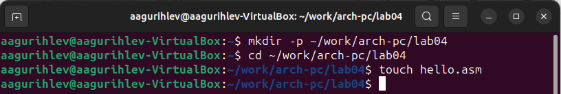
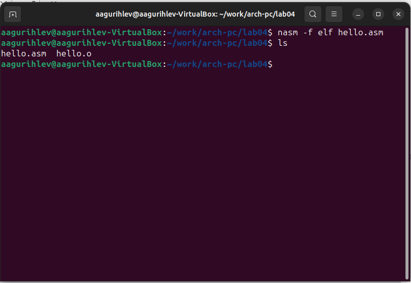
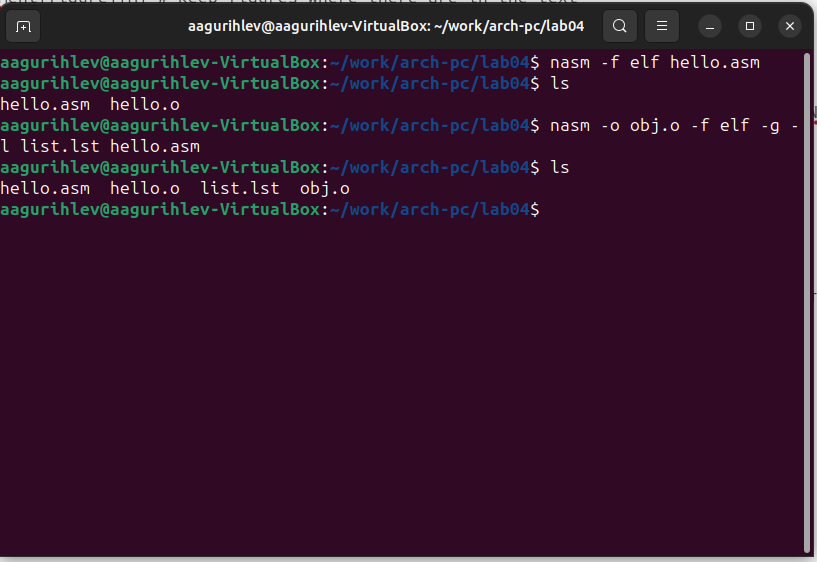
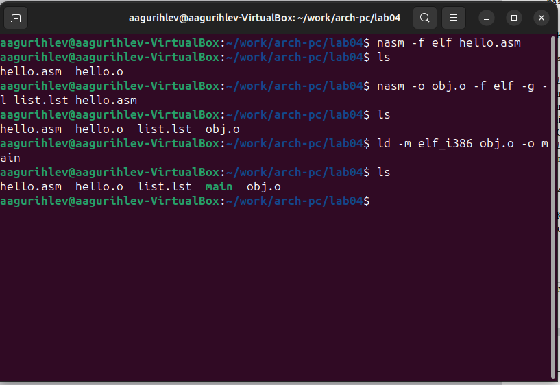
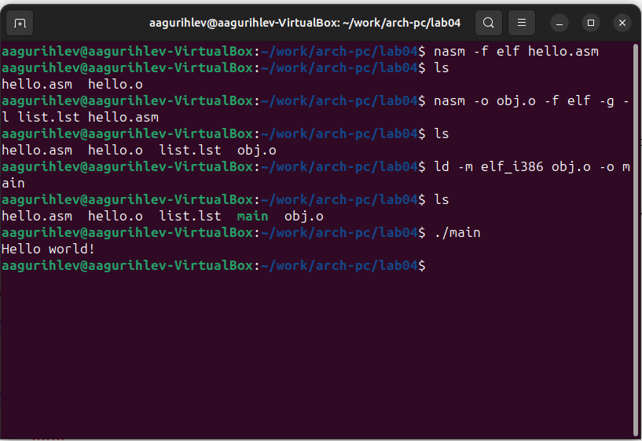
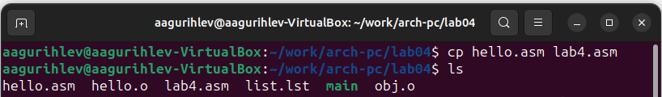
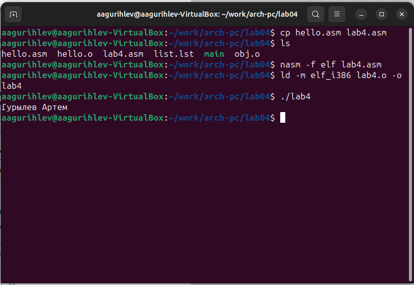
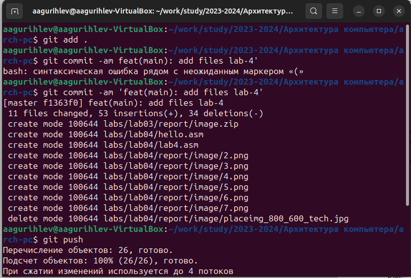

---
## Front matter
title: "Лабораторная работа №4"
subtitle: "Создание и процесс обработки программ на языке ассемблера NASM"
author: "Гурылев Артем Андреевич"

## Generic otions
lang: ru-RU
toc-title: "Содержание"

## Bibliography
bibliography: bib/cite.bib
csl: pandoc/csl/gost-r-7-0-5-2008-numeric.csl

## Pdf output format
toc: true # Table of contents
toc-depth: 2
lof: true # List of figures
lot: true # List of tables
fontsize: 12pt
linestretch: 1.5
papersize: a4
documentclass: scrreprt
## I18n polyglossia
polyglossia-lang:
  name: russian
  options:
	- spelling=modern
	- babelshorthands=true
polyglossia-otherlangs:
  name: english
## I18n babel
babel-lang: russian
babel-otherlangs: english
## Fonts
mainfont: PT Serif
romanfont: PT Serif
sansfont: PT Sans
monofont: PT Mono
mainfontoptions: Ligatures=TeX
romanfontoptions: Ligatures=TeX
sansfontoptions: Ligatures=TeX,Scale=MatchLowercase
monofontoptions: Scale=MatchLowercase,Scale=0.9
## Biblatex
biblatex: true
biblio-style: "gost-numeric"
biblatexoptions:
  - parentracker=true
  - backend=biber
  - hyperref=auto
  - language=auto
  - autolang=other*
  - citestyle=gost-numeric
## Pandoc-crossref LaTeX customization
figureTitle: "Рис."
tableTitle: "Таблица"
listingTitle: "Листинг"
lofTitle: "Список иллюстраций"
lotTitle: "Список таблиц"
lolTitle: "Листинги"
## Misc options
indent: true
header-includes:
  - \usepackage{indentfirst}
  - \usepackage{float} # keep figures where there are in the text
  - \floatplacement{figure}{H} # keep figures where there are in the text
---

# Цель работы

Целью работы является освоение процедуры компиляции и сборки программ, написанных на ассемблере NASM.

# Выполнение лабораторной работы

Создадим каталог lab04 для работы с программами ассемблера NASM, перейдём в него и создадим файл hello.asm(рис. @1)

{#fig:1}

Впишем в файл программный код, после чего выполним команду nasm в терминале для превращения текста программы и убедимся, что появился файл hello.o с помощью ls(рис. @2):

{#fig:2}

Выполним ещё одну команду nasm с другими параметрами, и убедимся в создании файлов(рис. @3):

{#fig:3}

Преобразуем объектный файл в исполняемый с помощью компоновщика ld(рис. @4):

{#fig:4}

Исполняемый файл имеет название main, как и прописано в команде. Выполним этот исполняемый файл(рис. @5):

{#fig:5}

# Выполнение лабораторной работы

Скопируем hello.asm как файл lab4.asm(рис. @6):

{#fig:6}

Внесём изменения в программу, чтобы она выводила фамилию и имя. Листинг программы:

```; lab4.asm
SECTION .data ; Начало секции данных
hello: DB 'Гурылев Артем',10 ; Фамилия и имя
; символ перевода строки
helloLen: EQU $-hello ; Длина строки hello
SECTION .text ; Начало секции кода
GLOBAL _start
_start: ; Точка входа в программу
mov eax,4 ; Системный вызов для записи (sys_write)
mov ebx,1 ; Описатель файла '1' - стандартный вывод
mov ecx,hello ; Адрес строки hello в ecx
mov edx,helloLen ; Размер строки hello
int 80h ; Вызов ядра
mov eax,1 ; Системный вызов для выхода (sys_exit)
mov ebx,0 ; Выход с кодом возврата '0' (без ошибок)
int 80h ; Вызов ядра
```

С помощью nasm и ld преобразуем lab4.asm сначала в объектный файл, затем в исполняемый, и запустим его(рис. @7):

{#fig:7}

Скопируем hello.asm и lab4.asm в указанный каталог, после чего загрузим файлы на Github(рис. @8):

{#fig:8}

# Выводы

В данной лабораторной работе я научился обрабатывать и исполнять программы, написанные на языке ассемблера NASM.

