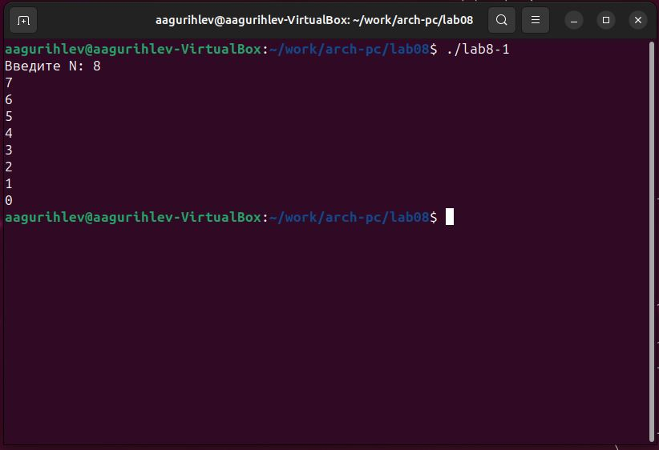

---
## Front matter
title: "Лабораторная работа №8"
subtitle: "Программирование цикла. Обработка аргументов командной строки"
author: "Гурылев Артем Андреевич"

## Generic otions
lang: ru-RU
toc-title: "Содержание"

## Bibliography
bibliography: bib/cite.bib
csl: pandoc/csl/gost-r-7-0-5-2008-numeric.csl

## Pdf output format
toc: true # Table of contents
toc-depth: 2
lof: true # List of figures
lot: true # List of tables
fontsize: 12pt
linestretch: 1.5
papersize: a4
documentclass: scrreprt
## I18n polyglossia
polyglossia-lang:
  name: russian
  options:
	- spelling=modern
	- babelshorthands=true
polyglossia-otherlangs:
  name: english
## I18n babel
babel-lang: russian
babel-otherlangs: english
## Fonts
mainfont: PT Serif
romanfont: PT Serif
sansfont: PT Sans
monofont: PT Mono
mainfontoptions: Ligatures=TeX
romanfontoptions: Ligatures=TeX
sansfontoptions: Ligatures=TeX,Scale=MatchLowercase
monofontoptions: Scale=MatchLowercase,Scale=0.9
## Biblatex
biblatex: true
biblio-style: "gost-numeric"
biblatexoptions:
  - parentracker=true
  - backend=biber
  - hyperref=auto
  - language=auto
  - autolang=other*
  - citestyle=gost-numeric
## Pandoc-crossref LaTeX customization
figureTitle: "Рис."
tableTitle: "Таблица"
listingTitle: "Листинг"
lofTitle: "Список иллюстраций"
lotTitle: "Список таблиц"
lolTitle: "Листинги"
## Misc options
indent: true
header-includes:
  - \usepackage{indentfirst}
  - \usepackage{float} # keep figures where there are in the text
  - \floatplacement{figure}{H} # keep figures where there are in the text
---

# Цель работы

Целью работы является приобретение навыков написания программ с использованием циклов и обработкой аргументов командной строки.

# Выполнение лабораторной работы

Создадим каталог для работы с программами и создадим файл lab8-1.asm: (рис. @1)

{#fig:1}

Введём код из листинга в файл lab8-1.asm, преобразуем его и проверим работоспособность: (рис. @2)

{#fig:2}

Изменим текст программы, добавив туда строчку с вычитанием из регистра ecx единицы, и проверим её работу(рис. @3):

{#fig:3}

Так как инструкция loop всегда сама по себе вычитает единицу из регистра ecx, то в программе этого не нужно делать, иначе проходов будет примерно в два раза меньше, так как при каждом из них из ecx будет вычитаться 2, а не 1.
Теперь изменим код программы, чтобы в ней использовался стек, и проверим её работу(рис. @4):

{#fig:4}

Число проходов соответствует введенному числу.
Создадим файл lab8-2.asm, введём из него код из листинга и создадим исполнительный файл, после чего запустим его из командной строки с аргументами(рис. @5):

{#fig:5}

Программа успешно обработала все аргументы, записанные в командной строке.
Создадим файл lab8-3.asm, введём из него код из листинга и создадим исполнительный файл, после чего запустим его из командной строки с аргументами(рис. @6):

{#fig:6}

Программа выводит сумму всех аргументов.

# Выполнение самостоятельной работы

Мой вариант - 16, следовательно функция, с которой я буду работать - _30x - 11_.
Листинг кода программы:

```%include 'in_out.asm'
SECTION .data
msg: DB 'Сумма значений функции: ', 0 ;
SECTION .text
global _start
_start:
pop ecx ;
pop edx ;
dec ecx ;
mov esi, 0 ; esi - сумма всех значений функции
func:
cmp ecx, 0 ;
jz _end ;
pop eax ;
call atoi ;
mov ebx, 30 ;
mul ebx ;
sub eax, 11 ;
add esi, eax ;
loop func ;
_end:
mov eax, msg ;
call sprint ;
mov eax, esi ;
call iprintLF ;
call quit ;
```

Пример работы программы(рис. @7):

{#fig:7}

# Выводы

В данной лабораторной работе я научился использовать стек, циклы и обработку аргументов командной строки в программах ассемблера NASM, которые нужны не только для правильной работы программ, но и для их оптимизации.
