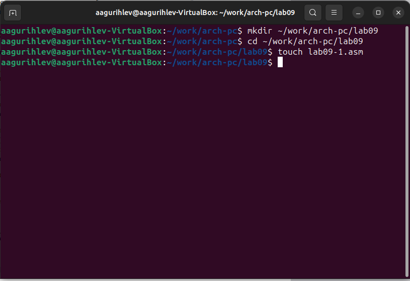
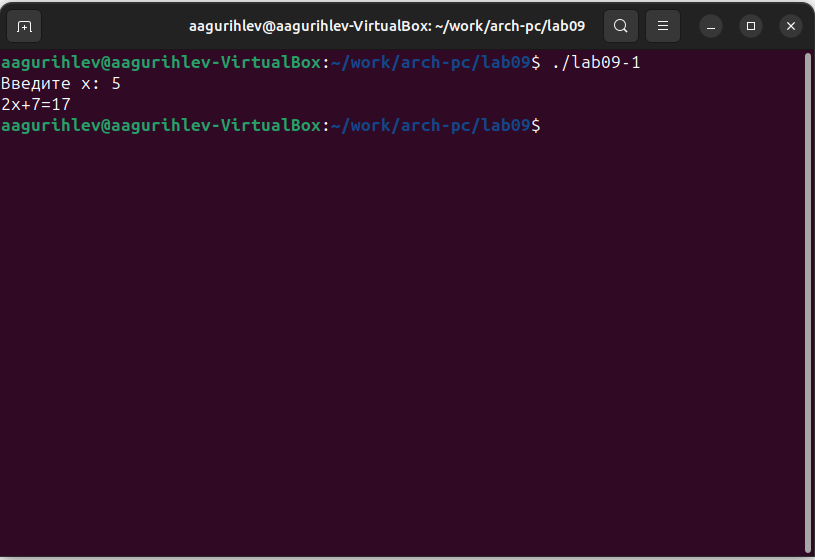
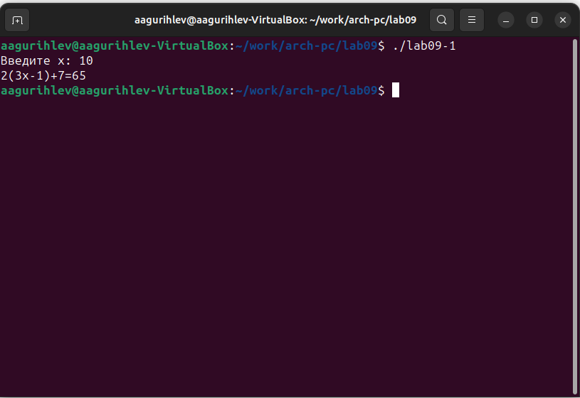
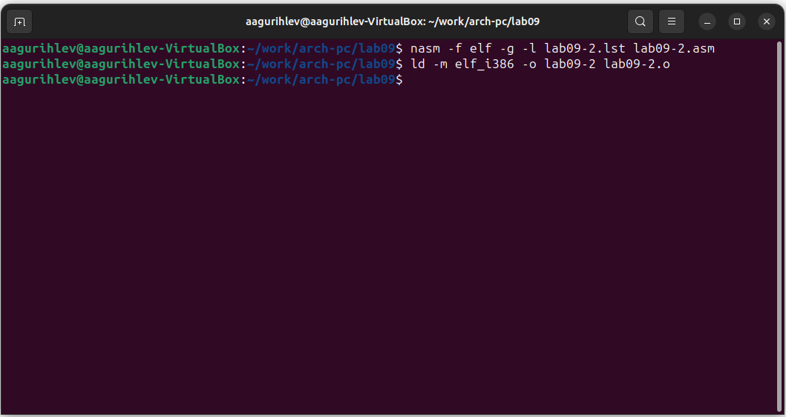
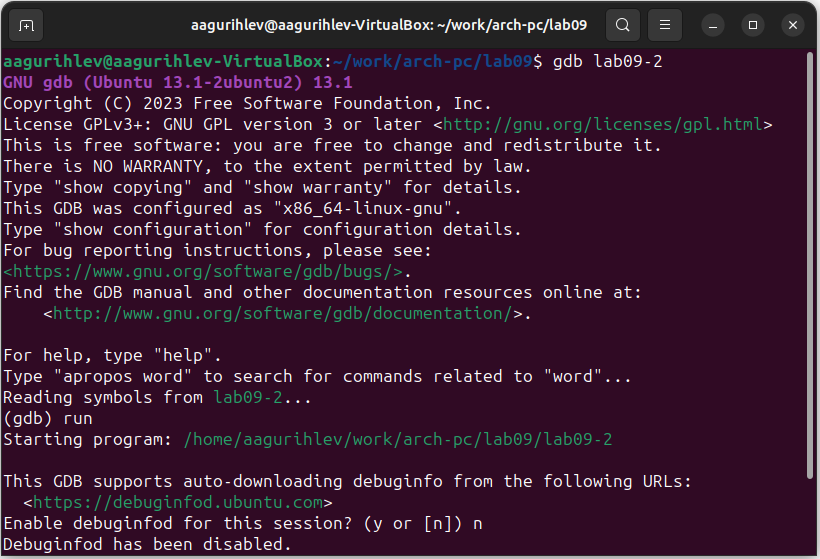
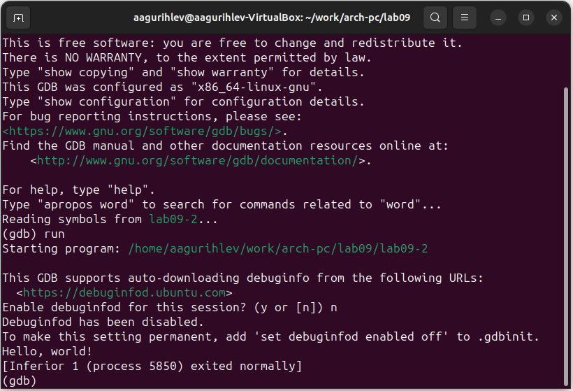

---
## Front matter
title: "Лабораторная работа №9"
subtitle: "Понятие подпрограммы. Отладчик GDB"
author: "Гурылев Артем Андреевич"

## Generic otions
lang: ru-RU
toc-title: "Содержание"

## Bibliography
bibliography: bib/cite.bib
csl: pandoc/csl/gost-r-7-0-5-2008-numeric.csl

## Pdf output format
toc: true # Table of contents
toc-depth: 2
lof: true # List of figures
lot: true # List of tables
fontsize: 12pt
linestretch: 1.5
papersize: a4
documentclass: scrreprt
## I18n polyglossia
polyglossia-lang:
  name: russian
  options:
	- spelling=modern
	- babelshorthands=true
polyglossia-otherlangs:
  name: english
## I18n babel
babel-lang: russian
babel-otherlangs: english
## Fonts
mainfont: PT Serif
romanfont: PT Serif
sansfont: PT Sans
monofont: PT Mono
mainfontoptions: Ligatures=TeX
romanfontoptions: Ligatures=TeX
sansfontoptions: Ligatures=TeX,Scale=MatchLowercase
monofontoptions: Scale=MatchLowercase,Scale=0.9
## Biblatex
biblatex: true
biblio-style: "gost-numeric"
biblatexoptions:
  - parentracker=true
  - backend=biber
  - hyperref=auto
  - language=auto
  - autolang=other*
  - citestyle=gost-numeric
## Pandoc-crossref LaTeX customization
figureTitle: "Рис."
tableTitle: "Таблица"
listingTitle: "Листинг"
lofTitle: "Список иллюстраций"
lotTitle: "Список таблиц"
lolTitle: "Листинги"
## Misc options
indent: true
header-includes:
  - \usepackage{indentfirst}
  - \usepackage{float} # keep figures where there are in the text
  - \floatplacement{figure}{H} # keep figures where there are in the text
---

# Цель работы

Целью работы является приобретение навыков написания программ с использованием подпрограмм и знакомство с методами отладки при помощи GDB и его основными возможностями.

# Выполнение лабораторной работы

Создадим каталог для работы с программами и создадим файл lab09-1.asm: (рис. @1)

{#fig:1}

Введём код из листинга в файл lab09-1.asm, преобразуем его и проверим работу программы: (рис. @2)

{#fig:2}

Изменим код программы, добавив подпрограмму _subcalcul в подпрограмму _calcul. Листинг подпрограмм:

```_calcul:
call _subcalcul ;
mov ebx,2
mul ebx
add eax,7
mov [res],eax
ret ; выход из подпрограммы
;
_subcalcul:
mov ebx, 3
mul ebx
sub eax, 1
ret;
```
Проверим работу программы: (рис. @3)

{#fig:3}

Создадим файл lab09-2.asm и введём в него код из листинга. Для получения отладочной информации добавим ключ -g в команде nasm: (рис. @4)

{#fig:4}

Загрузим программу в отладчик gdb и проверим её работу: (рис. @5 и рис. @6)

{#fig:5}

{#fig:6}

Установим брейкпоинт на _start:

# Выполнение самостоятельной работы

# Выводы

Здесь кратко описываются итоги проделанной работы.

# Список литературы{.unnumbered}

::: {#refs}
:::
