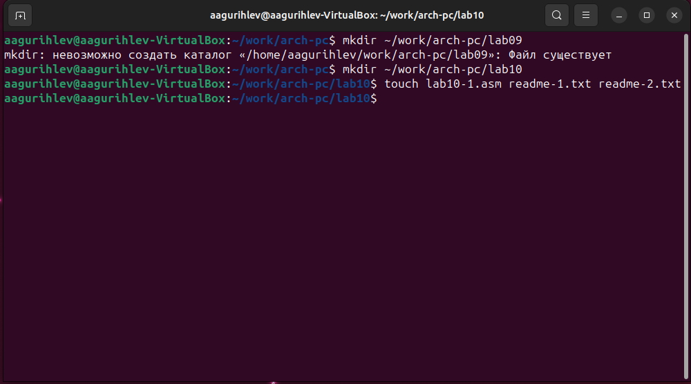
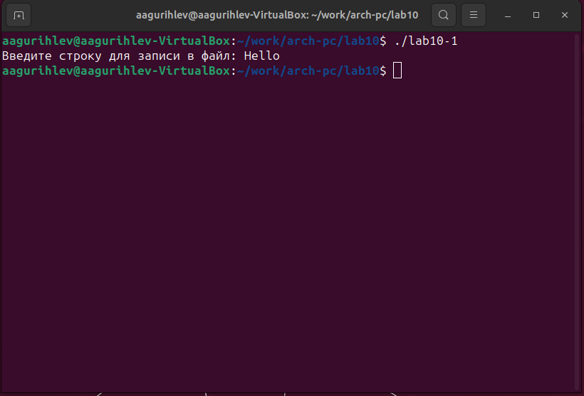
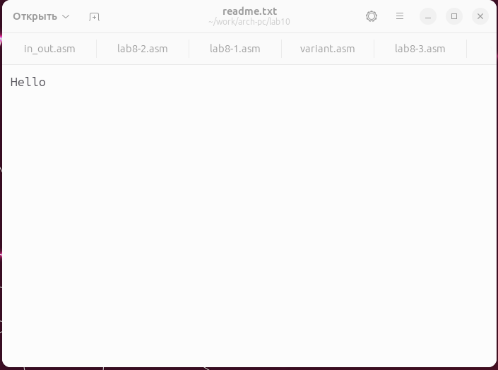
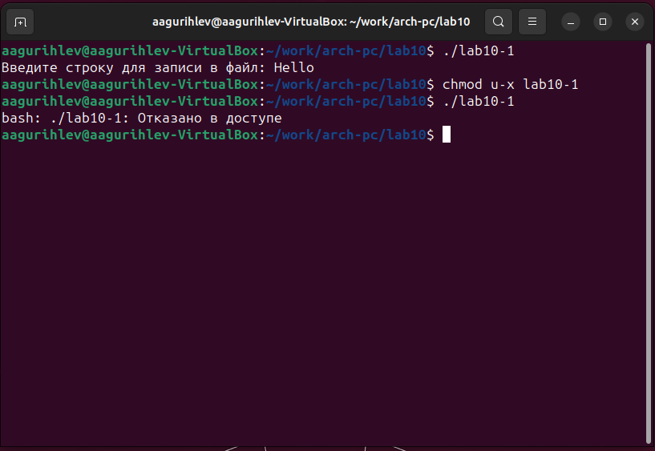
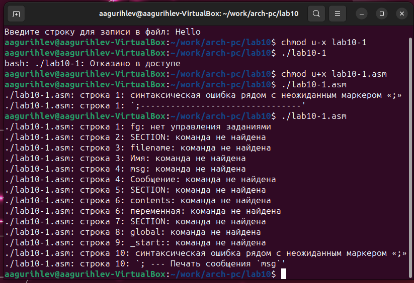

---
## Front matter
title: "Лабораторная работа №10"
subtitle: "Работа с файлами средствами Nasm"
author: "Гурылев Артем Андреевич"

## Generic otions
lang: ru-RU
toc-title: "Содержание"

## Bibliography
bibliography: bib/cite.bib
csl: pandoc/csl/gost-r-7-0-5-2008-numeric.csl

## Pdf output format
toc: true # Table of contents
toc-depth: 2
lof: true # List of figures
lot: true # List of tables
fontsize: 12pt
linestretch: 1.5
papersize: a4
documentclass: scrreprt
## I18n polyglossia
polyglossia-lang:
  name: russian
  options:
	- spelling=modern
	- babelshorthands=true
polyglossia-otherlangs:
  name: english
## I18n babel
babel-lang: russian
babel-otherlangs: english
## Fonts
mainfont: PT Serif
romanfont: PT Serif
sansfont: PT Sans
monofont: PT Mono
mainfontoptions: Ligatures=TeX
romanfontoptions: Ligatures=TeX
sansfontoptions: Ligatures=TeX,Scale=MatchLowercase
monofontoptions: Scale=MatchLowercase,Scale=0.9
## Biblatex
biblatex: true
biblio-style: "gost-numeric"
biblatexoptions:
  - parentracker=true
  - backend=biber
  - hyperref=auto
  - language=auto
  - autolang=other*
  - citestyle=gost-numeric
## Pandoc-crossref LaTeX customization
figureTitle: "Рис."
tableTitle: "Таблица"
listingTitle: "Листинг"
lofTitle: "Список иллюстраций"
lotTitle: "Список таблиц"
lolTitle: "Листинги"
## Misc options
indent: true
header-includes:
  - \usepackage{indentfirst}
  - \usepackage{float} # keep figures where there are in the text
  - \floatplacement{figure}{H} # keep figures where there are in the text
---

# Цель работы

Целью работы является приобретение навыков написания программ для работы с файлами.

# Выполнение лабораторной работы

Создадим каталог для работы с программами и создадим файлы lab09-1.asm, readme-1.txt и readme-2.txt: (рис. @1)

{#fig:1}

Введём код из листинга 10.1 в файл lab10-1.asm, создадим исполнительный файл и проверим работу программы: (рис. @2, @3)

{#fig:2}

{#fig:3}

Программа записала в файл readme.txt введённую строку. Важно заметить, что программа не создаст сама файл, если он отсутствует - она только изменяет существующий.

Теперь изменим права доступа к программе, используя команду chmod, запретив её исполнение, и проверим результат: (рис. @4)

{#fig:4}

Так как мы отобрали права исполнения у владельца(то есть моего пользователя в Linux), файл не может быть запущен.

Добавим права на исполнение файла lab10-1.asm, и попробуем его выполнить: (рис. @5)

{#fig:5}

Linux пытается запустить файл, подразумевая, что в нем его командный синтаксис, соответственно выводится большое количество подобных ошибок.

Предоставим права доступа к файлам readme-1.txt и readme-2.txt, соответствуя таблице с вариантами(мой вариант - 16): (рис @6)

{#fig:6}

# Выполнение самостоятельной работы

# Выводы

